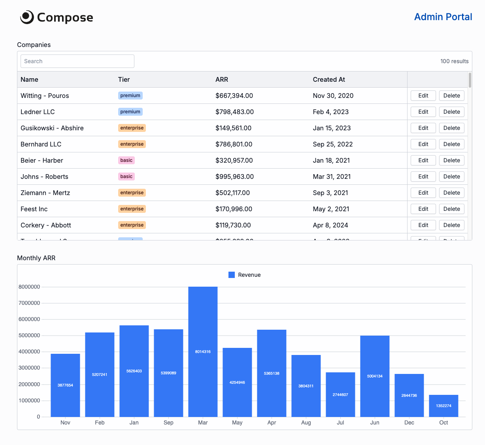

# Compose Internal Dashboard Demo

This repo contains a simple demo app that shows how easy it is to build custom internal tools with Compose.

The app is built in ~150 lines of Node.js code and can be found in `/src/apps/dashboard.ts`.

## Run this app yourself

You can run this app yourself in less than 5 minutes.

1. Clone this repo
2. Run `npm install`
3. Create a free acount to get an API key: https://app.composehq.com/auth/signup
4. Replace the API key in `/src/index.ts` with your API key
5. Run `npm run dev`

## How it works

The two key files are `src/index.ts` and `src/apps/dashboard.ts`.

- `src/index.ts` initializes the Compose client and connects to the [dashboard](https://app.composehq.com).
- `src/apps/dashboard.ts` contains all the code for the demo app.

There's also some additional files/folders:

- `src/database` creates a quick in-memory database to support the demo.
- `src/apps/router.ts` initializes a new session with the in-memory database and redirects to the dashboard.
- `public` screenshot of the dashboard for the `README.md`